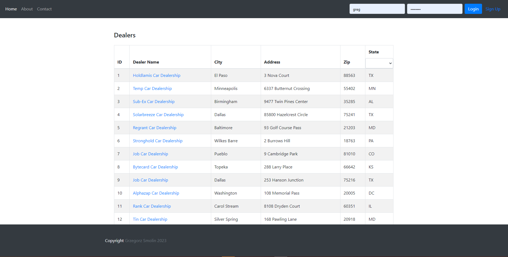
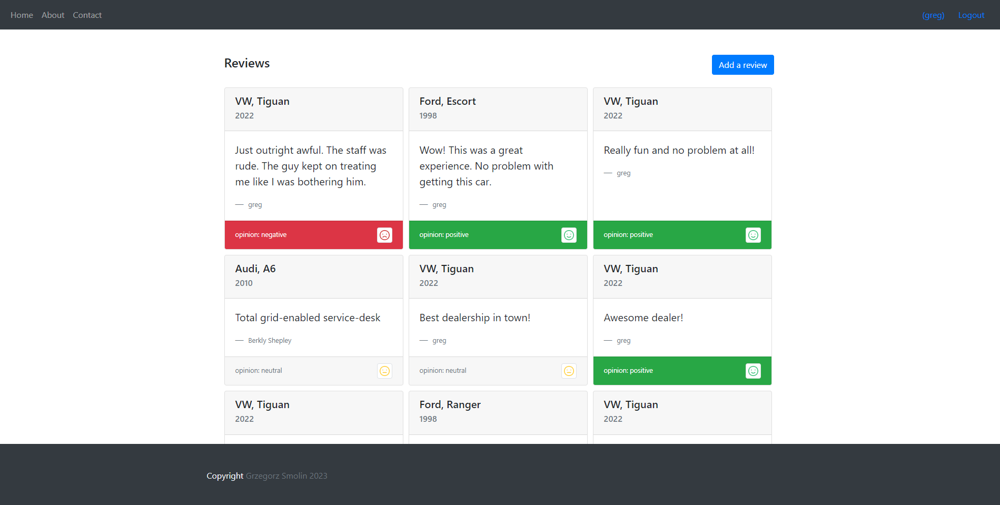

# Dealership comparison

Compare US car dealerships from across the country. View and add car dealership reviews.

## Tech specs
Web app written in Python Django and Node.js Serverless. Deployed on IBM Cloud.

Additional services used:
- Watson NLU
- Cloudant NosQL DB
- Github CI/CD

## Project Breakdown

**Prework: Sign up for IBM Cloud account and create a Watson Natural language Understanding service**
1. Create an IBM cloud account if you don't have one already.
2. Create an instance of the Natural Language Understanding (NLU) service.

**Added user management to the application**
1. Implemented user management using the Django user authentication system.
2. Set up continuous integration and delivery

**Implemented backend services**
1. Created cloud functions to manage dealers and reviews
2. Created Django models and views to manage car model and car make
3. Created Django proxy services and views to integrate dealers, reviews, and cars together
 
**Added dynamic pages with Django templates**
1. Created a page that shows all the dealers
2. Created a page that shows reviews for a selected dealer
3. Created a page that lets the end user add a review for a selected dealer

**Containerized application**
1. Added deployment artifacts to the application
2. Deployed application

## Screenshots

------------------

